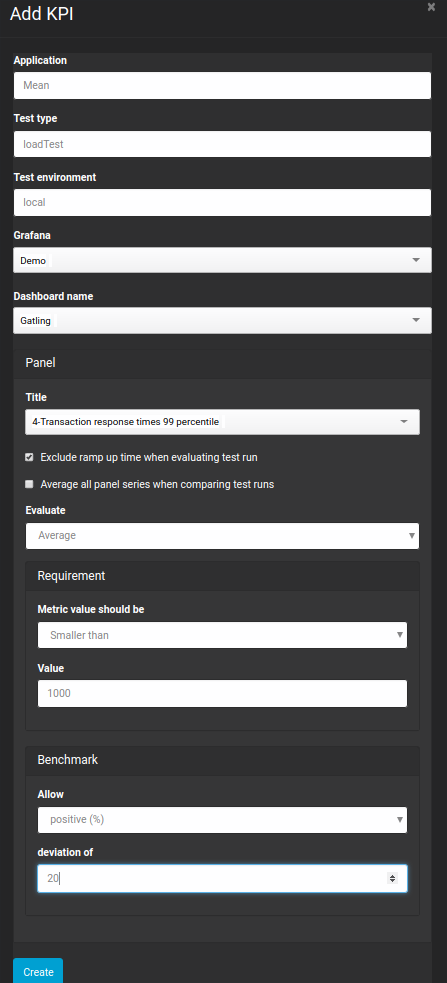
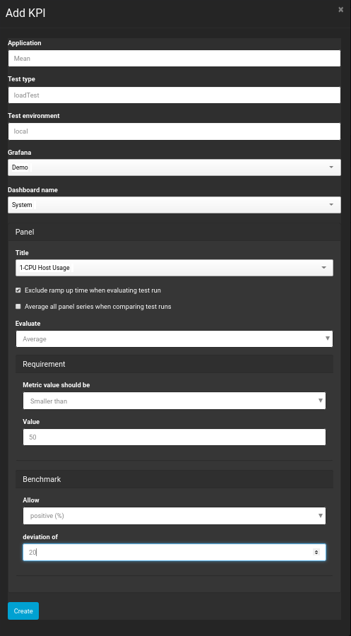
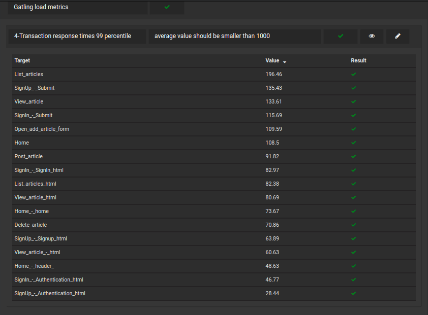
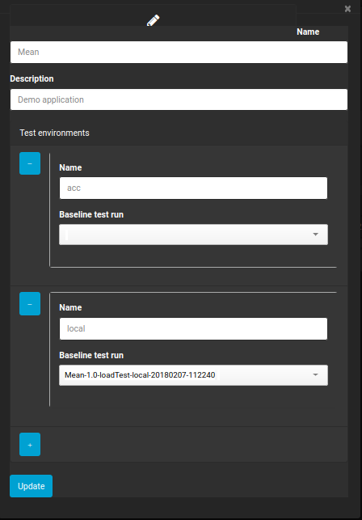
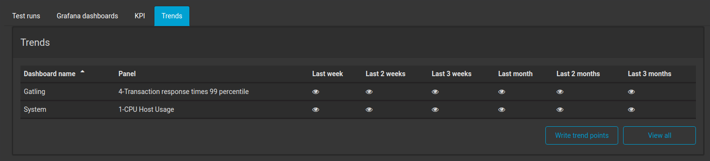

[Home](index.md) 
[Previous exercise](exercise-9.md) 
[Next exercise](exercise-11.md)  

# exercise 10: Adding Key Performance Indicators 

The Perfana dashboard can save you lots of time by automatically analyzing test results. It allows you to specify requirements for any metric that is available via a Grafana dashboard that is linked to a test. Furthermore it can compare test runs and report on deltas between them.

## Key Performance Indicators (KPI)

Perfana has two types of KPI's:

* Requirements
* Benchmark thresholds

Requirement are simple checks to validate if a metric is "smaller than" or "greater than" a specified value. For instance: "The percentage of failed transactions during the test should be smaller than 1"

The benchmark thresholds are used to check if metric deviation between test runs are within a specified range, absolute or relative. An example: "The allowed deviation between two test runs in average response times should not be greater than 25%"

Now let's add some KPI's to our test!

* Click "Applications" in the side menu
* Use the filters to select application "Mean", environment "local" and test type "loadTest"
* Click on the "KPI" tab and click "Add KPI"
* Create the following KPI's: 

 

> The "Average all panel series when comparing test runs" is checked for the CPU Host Usage KPI. This is done because the Mean (nodeJs) process is single threaded and bound to one core only. This could well be a different core next time we run the test! 

As soon as a KPI has been added or updated, Perfana will analyze all test runs that the KPI applies to. To see the result, navigate to the test run summary view. The benchmark section will show the consolidated result for the specified requirements. You can drilldown to more details by clicking on the result. 





To see some test run comparison results we have to run the test again:

```  
mvn clean install perfana-gatling:integration-test -Ptest-env-local,test-type-load
```

Perfana will automatically do two test run comparisons after a test run has finished:

* Comparison to the previous test run: this will provide you with feedback on performance impact of the latest changes of your application.
* Comparison to a baseline test run: you can specify a test run as a baseline to compare future test runs against. 

While the test is running we will set the first test run as baseline:

* Use the application filter to select application "Mean"
* Click the "edit apllication" icon
* Select the baseline test run for environment "local" from the drop down list

 


When the running test has finished, you will see additional benchmark results in the test run summary. In this case the baseline test run == previous test run, so let's start a third test run.

If you drill down to the comparison results you can also do a visual check by clicking on the "eye" icon. That might help you to determine "false negatives". Also, it is possible to edit the KPI's by clicking the "pencil" icon. 

> When KPI's are updated, Perfana will automatically re-evaluate them for all test runs!

## Trends

Once you have defined one or more KPI's Perfana can automatically create trend graphs for those KPI's. This requires an InfluxDb instance to store the trend data and a Grafana instance to host the Perfana trends dashboard.   
   
To view trends:

* Click "Applications" in the side menu
* Use the filters to select application "Mean", environment "local" and test type "loadTest"
* Click on the "Trends" tab

 

You can use the presets to view specific time frames for KPI's or choose "View all" to customise your trends view. The vertical lines in the graphs mark the test runs, if you hover the bottom of those markers the test run ID will show. 

If, for some reason, Perfana failed to write the trend points to InfluxDb you can trigger this manually bij clicking "Write trend points".

