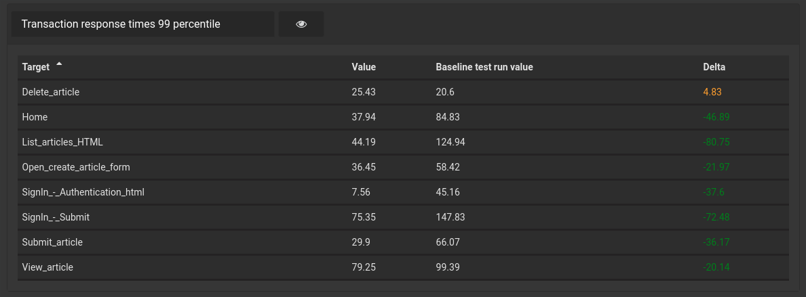
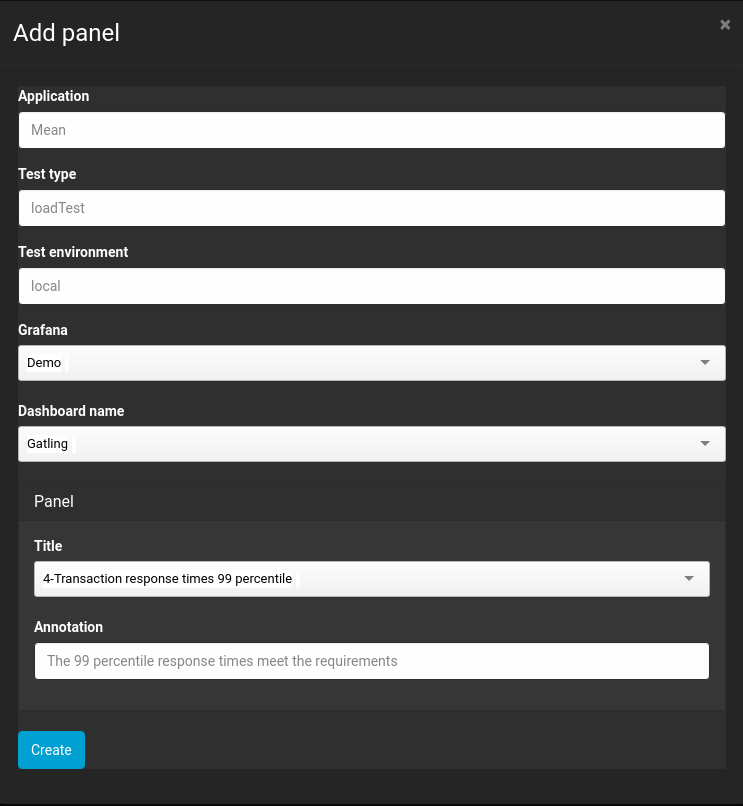
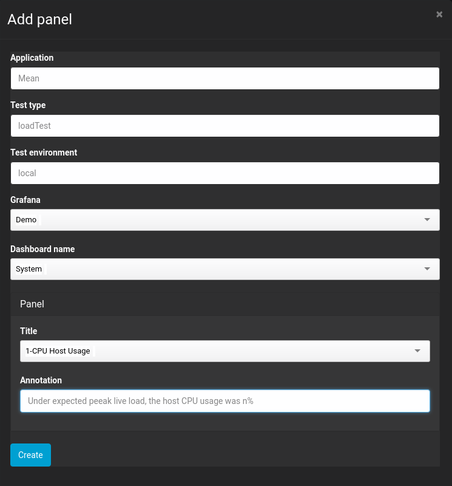
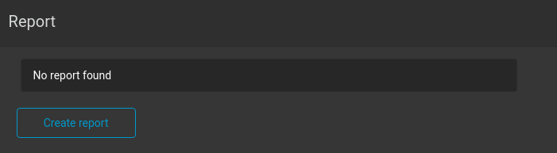
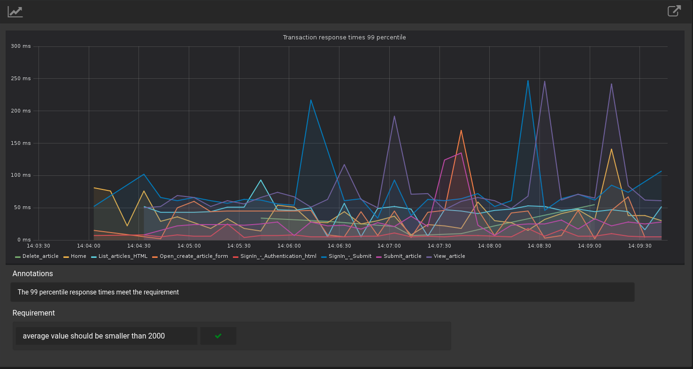

[Home](index.md) 
[Previous exercise](exercise-10.md) 
[Next exercise](exercise-12.md)  

  

# Test run comparison

Apart from the automated KPI benchmarks it is possible to compare a test runs to any other test run. In the test run summary view, select a test run from the drop down list. You can choose from running the KPI benchmark comparison to this test run or running a full test run comparison.

             
> If Perfana cannot match any targets for a metric between two test runs, it will compare the average value for all targets!
 
# Test run reporting

If you share load test results with stakeholders, it is usually a good idea to summarize the results in a report with relevant graphs and information only. Perfana allows you to generate a report for a test run automatically based on a configured template. 

## Configure report template

To configure a report template, follow these steps:

* Click "Applications" in the side menu
* Use the filters to select application "Mean", environment "local" and test type "loadTest"   
* Open the "Report specification" tab
* Click "Add panel"
* Select dashboard and panel. You can add a default annotation to save yourself some time :-)

* Add another panel

* Using the arrows you can determine the order of the panel in the report.

## Generate report

Once you have created a report template, you can generate a report for a test run from the test run summary view by clicking "create report" in the "Report" section. 

The generated report contains the following sections:

* Test run information / meta data
* Links to the Grafana snapshots for the test run
* The consolidated requirement results for the test run. You can click to drill down to a more detailed results.
* The panels configured in the report template

For each panel is displayed:

* A graph in PNG format. You can use the icon in the top left corner to toggle to an interactive version of the graph. Use the icon in the top right corner to open a full screen interactive graph in Grafana.
* If a KPI requirement has been configured for the panel, the asserted results are displayed. Click to see more details.
* If provided, the default annotation is displayed. You can click the annotation to update it.  

[Home](index.md) 
[Previous exercise](exercise-10.md) 
[Next exercise](exercise-12.md)  
