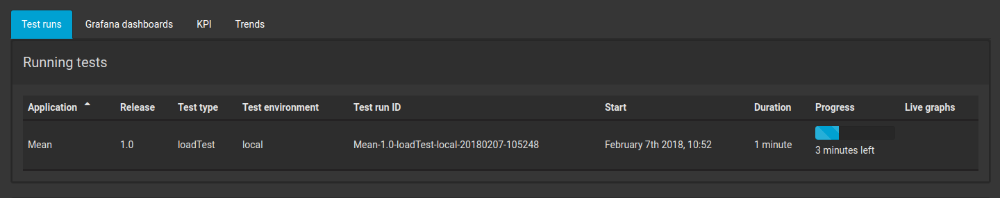
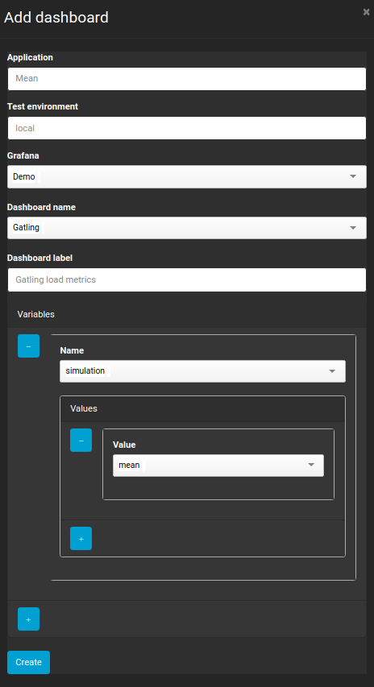
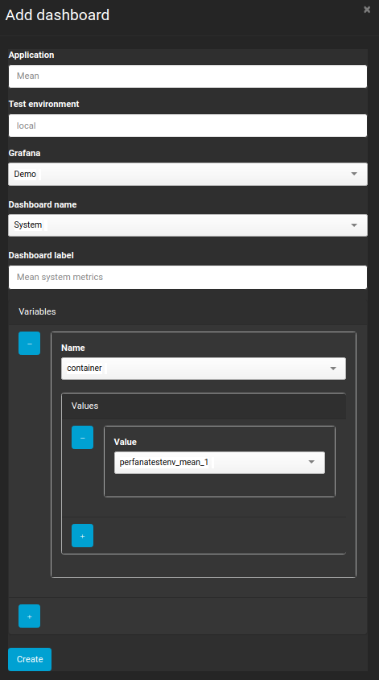

[Home](index.md) 
[Previous exercise](exercise-8.md) 
[Next exercise](exercise-10.md)  

# exercise 9: View test results in Perfana 

If all went according to plan you now have a load test running against the Mean demo app running at localhost port 3333. Let's op the Perfana dashboard at

```xml
http://localhost:3000
```  

First sign in with user: admin@example.com, password: admin.

You should see a running test:




## Sync Grafana dashboards
Now let us link some Grafana dashboards to display the test results. The demo environment comes with a Grafana instance with some preconfigured dashboards. You can access this Grafana instance with user/pwd foobar/foobar

```
http://localhost:4000 
```
When you click the "Home" button in the top left of the screen you can see a number of dashboards. To link a dashboard from a Grafana instance with Perfana, you just tag it with "Perfana". Then you sync your Grafana instance with Perfana.   

If you followed the [steps how to setup the demo environment](https://github.com/perfana/perfana-test-env/blob/master/README.md), you have already synced the dashboards once.

> The [Grafana templating](http://docs.grafana.org/reference/templating/) variable names and values are stored at the moment the dashboards are synced. Sometimes you need to refresh a dashboard in the Grafana view to update te values. In our case we will use the "Gatling" and "System" dashboard, so please sync those by clicking on the "refresh" icon in the dashboard row.   

Perfana will use the [Grafana HTTP API](http://docs.grafana.org/http_api/) to import the dashboard configuration. 

> If you want to edit the imported dashboard configuration, click on the dashboard row.

To link the imported dashboards to our application, follow these steps:

* Click "Applications" in the side menu
* Use the filters to select application "Mean" and environment "local"
* Click on the "Grafana dashboards" tab and click "Add dashboard"
* Use the drop down values to link the "Gatling" dashboard:




* Add a dashboard for capturing some System metrics for the Mean application:



Now we have linked some dashboards to the application we can have a look at the load test results in the "Test runs" tab. By now the running test has probably finished and the test run will be available in the "Recent test run section". Click on the test run to go to the test run summary view.

The test run summary view has a number of sections:

* Test run information: some meta data for the test run. It is possible to add annotations here.
* Grafana dashboard links: these links will deeplink you into the Grafana dashboards
* Grafana snapshots: Perfana uses the [Grafana snapshot feature](http://docs.grafana.org/reference/sharing/#dashboard-snapshot) to store snapshots of test run dashboards. More on snapshots later. 
* Benchmarks: This section show the benchmark results of the configured KPI's. In the next exercise we will look into this. 
  
## Snapshots

At the end of a test run, a snapshot is automatically generated for each of the dashboards that are linked to the application / test environment. If for some reason (for instance if the test ran before any dashboards were configured) you can create the snapshots manually.
  
Snapshots for a dashboard are stored in the Grafana instance that hosts the dashboard, unless a specific "snapshot Grafana instance" has been specified in the configuration.

Snapshots have a expiry that is set in the Perfana configuration. In the demo environment snapshots are deleted after 90 days. If you want to keep a snapshot from expiring, you can set it to "never expire" by clicking the "Save" icon.

You can view the snapshots by clicking the dashboard name.   

[Home](index.md) 
[Previous exercise](exercise-8.md) 
[Next exercise](exercise-10.md)  


  
